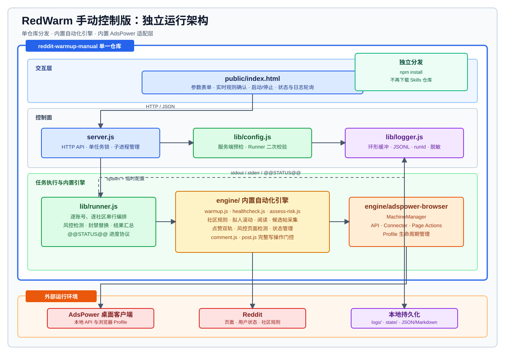

# RedWarm 手动控制版

Reddit 养号的独立手动控制台：填写账号和社区参数、点击启动，即可运行浏览、阅读、点赞、评论和发帖任务。

项目已经内置养号引擎和 AdsPower 浏览器适配层。其他使用者只需下载本仓库并执行 `npm install`，不需要再下载 `reddit-warmup-skills`，也不需要单独安装 `adspower-browser` Skill。

> 使用须知：本工具用于多账号养号，可能违反 Reddit 用户协议，并存在封号及浏览器指纹标记风险。评论和发帖会经过档位、频率、社区规则及内容检查，但风险仍由使用者承担。

## 架构



源码依赖全部包含在当前仓库中。运行时仍需 AdsPower 桌面客户端、有效浏览器 Profile、Reddit 登录态和可用网络。

## 私信触达（Outreach）

独立于养号的自动私信扩展（设计文档见 `docs/outreach-design.md`）：

1. **发现**：指定社区 + 标题关键词 → 拉取 recent 帖子 → 收集评论者
2. **队列**：评论者全量入队（仅排除帖主/版主/机器人/已联系用户），跨运行去重
3. **发送**：全自动经 AdsPower 浏览器限频发送私信（单次执行数量可配置，默认 20 条，间隔随机 60–120s）
4. **审计**：`logs/outreach-YYYY-MM-DD.jsonl`（逐条发送记录）+ Markdown 运行报告

控制台「私信触达」Tab 提供发现/发送/停止操作与只读队列监控。
运行前置条件：AdsPower 客户端、目标 Profile 已登录 Reddit、本机可访问 Reddit。

```bash
# 命令行单独运行（等价于控制台操作）
node lib/outreach/discover.js --config /tmp/outreach-discover.json
node lib/outreach/sender.js --config /tmp/outreach-send.json
```

配置文件需包含：`target`（serial/profiles/group）、`sub`、`keywords`、`template`（含 `{username}`），以及可选风控参数（`runLimit`/`sendIntervalMin`/`sendIntervalMax` 等，见 `lib/config.js parseOutreachConfig`）。

**发送通道 `channel`（默认 `compose`）：**

| channel | 说明 |
|---|---|
| `compose`（默认） | 经 AdsPower 浏览器打开 Reddit 私信 compose 页面发送；兼容新版 UI，发送后消息同步出现在 Chat 会话中。实测不受 Chat 房间创建限额影响 |
| `matrix` | 直连 Reddit Chat 的 Matrix API（`matrix.redditspace.com`）发送，无需操作页面 DOM。注意 Reddit 对 `createRoom` 有 **24 小时房间数量限额**（`M_LIMIT_EXCEEDED`），新用户量大时会触限；触限后条目标记 `failed`，可 `requeue` 等限额重置后重发 |

## 目录结构

```text
reddit-warmup-manual/
├── server.js                    # HTTP 服务和任务进程管理
├── lib/
│   ├── runner.js                # 手动任务编排器
│   ├── config.js                # 服务端与 Runner 共用的配置校验
│   ├── logger.js                # 结构化日志
│   └── outreach/                # 私信触达模块（discover/queue/sender + 测试）
├── engine/                      # 内置自动化引擎
│   ├── lib/                     # 规则、点赞、状态和浏览辅助能力
│   ├── scripts/                 # 浏览、巡检、评论和发帖脚本
│   └── adspower-browser/lib/    # AdsPower 浏览器适配层
├── public/index.html            # HTML 控制台
├── state/posts.json             # 近期发帖频率状态（自动生成）
└── logs/                        # 运行报告和服务日志（自动生成）
```

## 环境要求

- Node.js 18 或更高版本
- AdsPower 客户端正在运行
- AdsPower 中已有可用并登录 Reddit 的浏览器 Profile
- 本机能够正常访问 Reddit

所有 JavaScript 依赖都由当前项目的 `npm install` 安装。

## 安装与启动

```bash
cd reddit-warmup-manual
npm install
npm start
```

默认打开：`http://127.0.0.1:8787`

指定端口：

```bash
npm start -- --port 9000
# 或
PORT=9000 npm start
```

运行检查：

```bash
npm run check
npm test
```

## 控制台配置

| 配置 | 说明 |
|---|---|
| 目标账号 | AdsPower serial、Profile ID 或分组名，支持逗号分隔多个值 |
| 社区模式 | 指定社区，或从内置社区池随机选择 |
| 每账号板块数 | 当前账号本轮实际执行的社区浏览次数 |
| 每板块时长 | 每个社区的停留时长区间，范围 1-180 分钟 |
| 点赞比例 | 对候选帖随机点赞的概率 |
| 阅读详情比例 | 浏览时打开帖子详情阅读的概率 |
| 评论比例 | 每个社区触发一条评论的概率 |
| 评论规则确认 | 实时读取规则 Hash，并记录仍需人工确认的项目 |
| 发帖功能 | 标题、正文、候选社区、规则确认、Flair 和频率限制 |
| 绕过档位门控 | 仅用于测试；其他规则和内容门控仍然保留 |

## 运行流程

1. 控制台向 `POST /api/run` 提交配置。
2. 服务端使用 `lib/config.js` 校验并规范化配置。
3. 服务端把配置写入临时 JSON，并启动 `lib/runner.js` 子进程。
4. Runner 使用内置 `engine/` 连接 AdsPower，逐账号、逐社区串行执行任务。
5. 评论和发帖通过内置 `comment.js`、`post.js` 子进程执行完整门控。
6. Runner 通过标准输出发送日志和 `@@STATUS@@` 状态事件。
7. 服务端把日志写入内存环形缓冲和每日 JSONL 文件。
8. 任务结束后在 `logs/` 生成 JSON 和 Markdown 报告。

## 写操作门控

- **账号资格**：评论和发帖脚本根据账号年龄及 Karma 计算风险档位。
- **近期发帖频率**：`state/posts.json` 记录每个账号的发帖时间戳，默认近 7 天最多 2 篇。
- **实时社区规则**：评论前自动读取当前规则 Hash；发帖规则可在控制台中预读取。
- **未决项确认**：无法自动判断的规则条款需要确认，Flair 不会被自动猜测。
- **内容检查**：评论和发帖继续使用内置引擎中的质量与 AI 痕迹检查。

## API

| 方法 | 路径 | 说明 |
|---|---|---|
| GET | `/` | 控制台页面 |
| GET | `/api/status` | 当前任务状态 |
| GET | `/api/logs?since=N&level=warn` | 增量结构化日志 |
| GET | `/api/subs` | 内置社区池 |
| POST | `/api/rules` | 使用目标账号读取社区规则 |
| POST | `/api/run` | 启动任务 |
| POST | `/api/stop` | 向当前 Runner 发送 SIGTERM |
| GET | `/api/outreach/status` | 私信触达任务状态 + 队列统计 |
| GET | `/api/outreach/queue?status=` | 候选队列（只读，可按状态过滤） |
| GET | `/api/outreach/report?date=` | 私信触达审计报告（JSONL） |
| POST | `/api/outreach/discover` | 启动评论者发现并入队 |
| POST | `/api/outreach/send` | 启动全自动发送（pending 队列） |
| POST | `/api/outreach/stop` | 停止当前私信触达任务 |

## 日志与状态

服务日志同时写入：

- 内存环形缓冲：供控制台增量轮询，默认保留 2000 条。
- `logs/server-YYYY-MM-DD.jsonl`：用于长期留存和故障排查。

日志包含单调递增序号、时间、等级、来源、事件名和 `runId`。名称匹配 password、token、secret、cookie、authorization、proxy 的上下文字段会在持久化前替换为 `[REDACTED]`。

可通过 `LOG_LEVEL=debug|info|warn|error` 调整最低日志等级。日志持久化失败不会中断运行任务。

## 独立分发边界

本仓库现在包含运行所需的 JavaScript 源码，不依赖旁边存在另一个源码仓库。它仍然需要 AdsPower 桌面客户端、有效 Profile 和 Reddit 登录态，这些属于运行时外部服务，不随源码分发。
